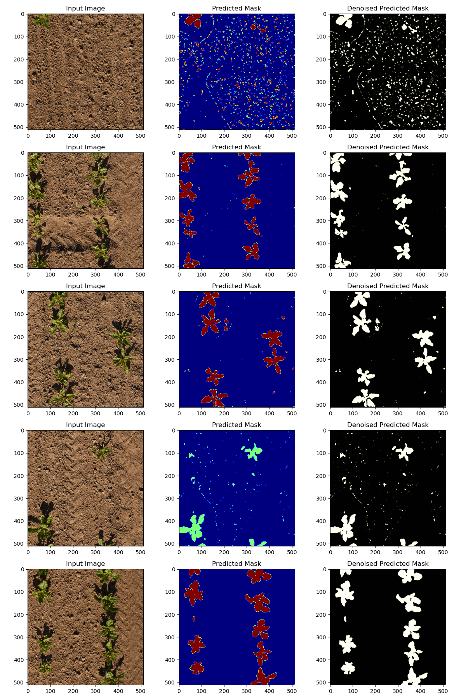

# Advanced Methods for Image Processing course
<p align="center">
    
</p>

## Weed segmentation final project on the CropSegmentation Dataset
Authors: Hala __Zayzafoun__, Bolutife __Atoki__, Tamas __Bukits__
 
## Introduction
The aim of this project was to implement crop and weed segmentation on images taken by a drone
on crop fields, by segmenting each pixel in the image into either the background, a crop, or a weed.
This was performed by implementing networks created across the lab sessions (__VAE__ and __UNET__
architectures) for segmenting, and applying the Convolutional Blind Denoising Network for noise
removal, and then evaluating the segmentation networks using Metrics provided during the lecture
and labs.

The technical report can be found under this [link](https://drive.google.com/file/d/1rQsxrThFs16HY8nAbEzaAgcdCvBHVW8i/view?usp=share_link).


## Installation

To use this project, follow these steps:

1. **Clone the Repository:**
   ```bash
   git clone https://github.com/bukits/weed-segmentation.git
   cd your-repository
   ```

2. **Installing Python packages:**

    The project requieres the use uf GPU, the code was tested on Windows using CUDA 10.2 and on Ubuntu using CUDA 11.8 using Python 3.18 and PyTorch as a framework.

    Intsalling the python packages you have to run the package installation file:

    ``` 
    conda env create --file=environment.yml
    ```

## Training the model

1. To train the UNet model, run the following command:
    ``` 
    python train-unet.py
    ```
    which will create the __model_unet.pth__.
2. To train the Variational Auto Encoders model, run the following command:
    ``` 
    python train-vae.py
    ```
    which will create the __model_vae.pth__.

## Testing the model

Testing the model on a selected test dataset you have to run the following command with the paramaeters:

* test_folder: path to the test dataset which has 2 folders (images, labels)
* model_path: path to the trained model which can be UNet or VAE.
* batch_size: you can provide the batch size for testing, the deafult is 8.

```
python run.py --test_folder dataset --model_path weights/model_unet.pth
```
After running this command the script generates a metrics.txt file where the used metrics are collected. We implemented 5 different kind of metrics: __Intersection over Union__, __Mean Intersection over Union__, __Pixel Accuracy__, __Mean Pixel Accuracy__, __Dice Coefficient__. Also, the script plots 5 randomly generated examples with original image, and the predicted mask. 

## Results

This is performed visually by randomly selecting 5 image samples from the __validation__ dataset,
applying the UNET model on it for segmenting the objects in the image into background, crop
and weed, and then applying the CBDNetwork for denoising, and then plotting the image, the
predicted mask and the denoised mask. Examples of the images are provided below:
<p align="center">
  <table>
    <tr>
      <td align="center">
        
        <br />
        <em>Segmentation samples using UNET + CBNET</em>
      </td>
      <td align="center">
        
        <br />
        <em>Segmentation samples using VAE + CBDNET</em>
      </td>
    </tr>
  </table>
</p>

The metrics results can be found in the generated metrics.txt file.